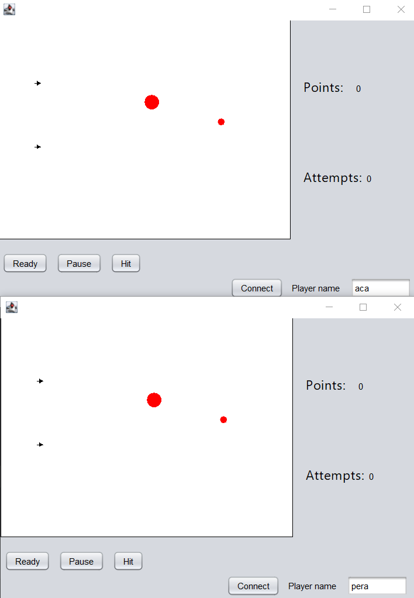

# Description

Simple java multiplayer game.Default number of players is 2.Players connect to server to start the game.After expected number of players connect game starts.In order for game to run all players need to be ready.If only one of them is not ready game will stop.

# Rules

- Every player posses they own arrow
- Two balls are bouncing up and down the screen
- One ball is bigger and slower(worth 1 point)
- Another ball is smaller and faster(worth 2 points)
- On the click of button("Hit") arrow starts moving
- If the arrow hits the ball both arrow and ball are returned on started position and player is rewarded with points according to ball he had hit
- If the arrow is missed both balls and reached end of screen it is returned on the starting position.
- First player to reach expected number of points(default is 6)is a winner

 

# Technologies

- JDK 21
- Java Swift
- Lombok
- Jackson Object Mapper

# How to run

- Clone project
- Run MainServer class first
- Run instances of ClientFrame class